### * Android
| Homepage | New Note | Search |
| :---: | :---: | :---: |
| 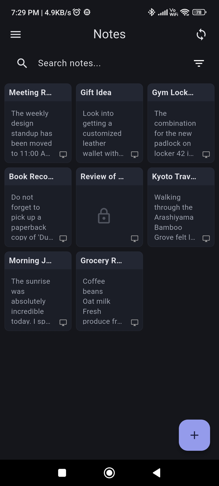 | 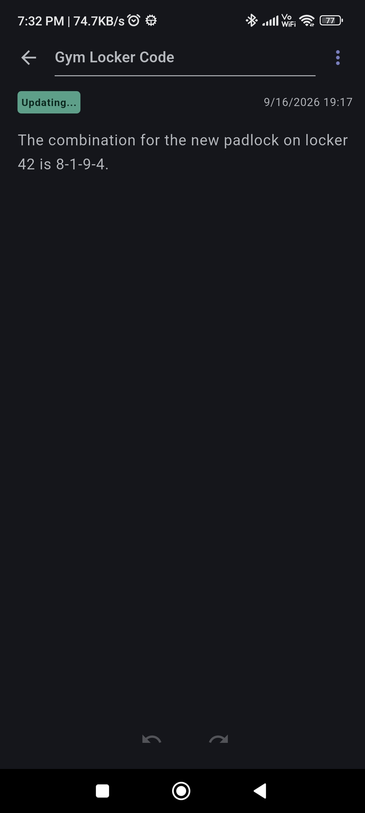 | 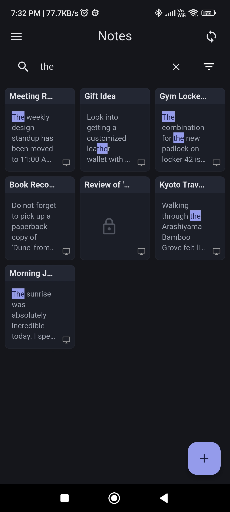 |

| Sidebar | Theme Settings | Password Lock |
| :---: | :---: | :---: |
| 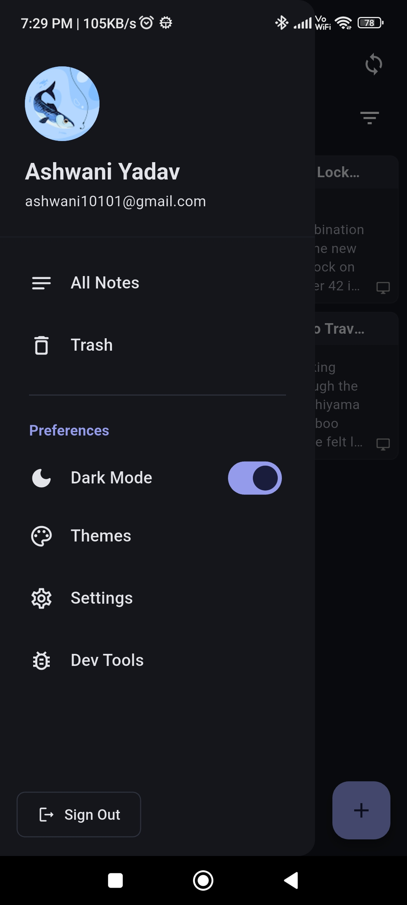 | 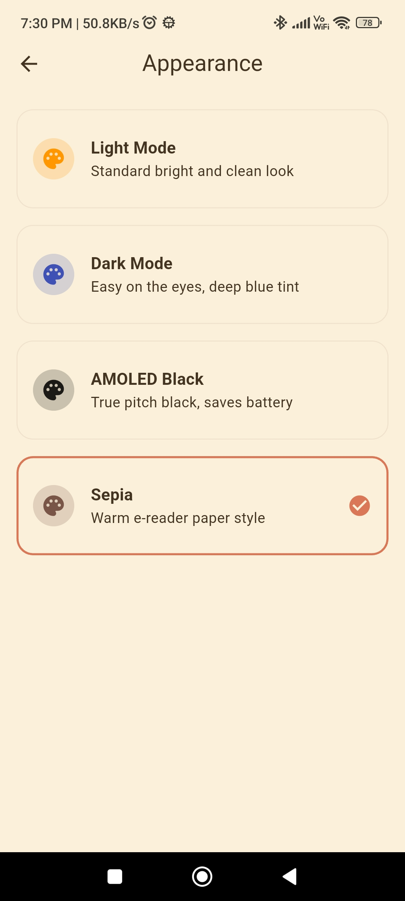 | 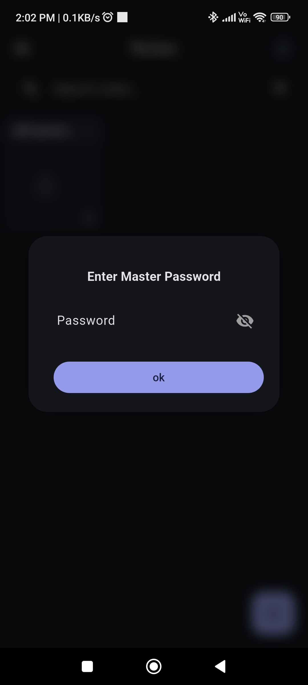 |

| Google Sign-In | Filters | Trash Bin |
| :---: | :---: | :---: |
| 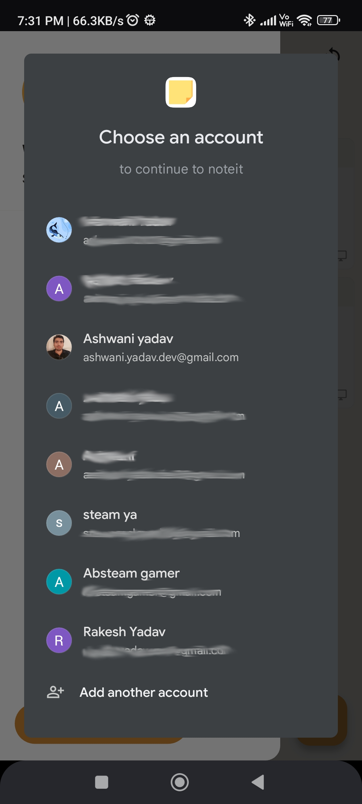 | 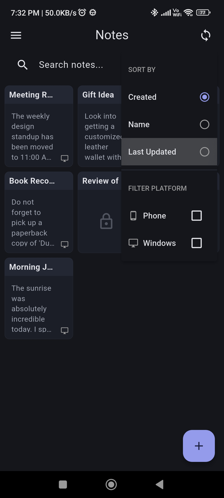 | 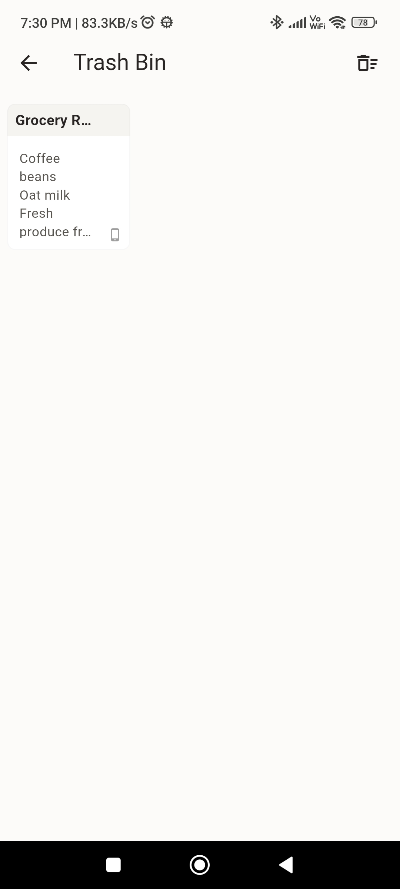 |

### * Windows
| Desktop Homepage | Desktop Sidebar |
| :---: | :---: |
| 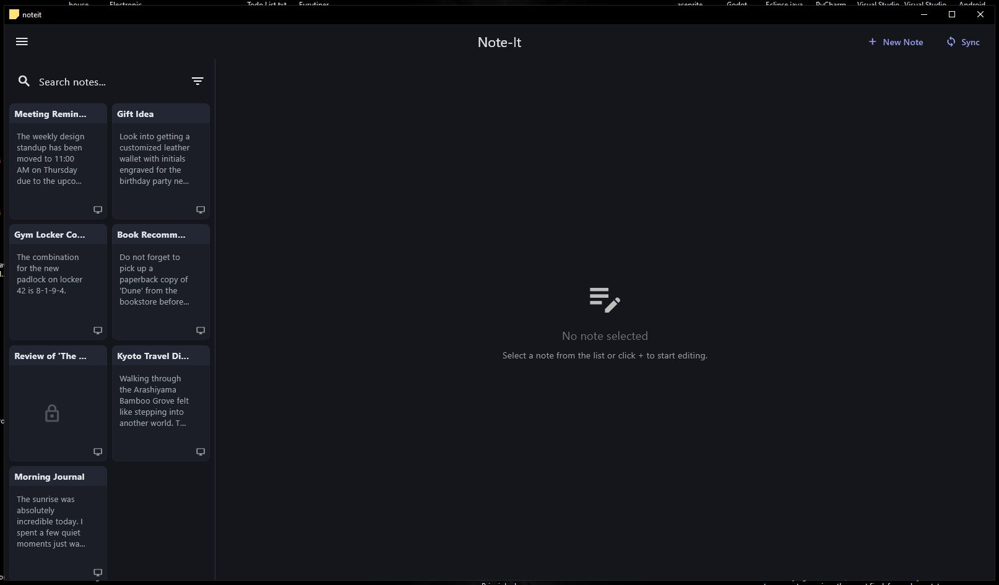 | 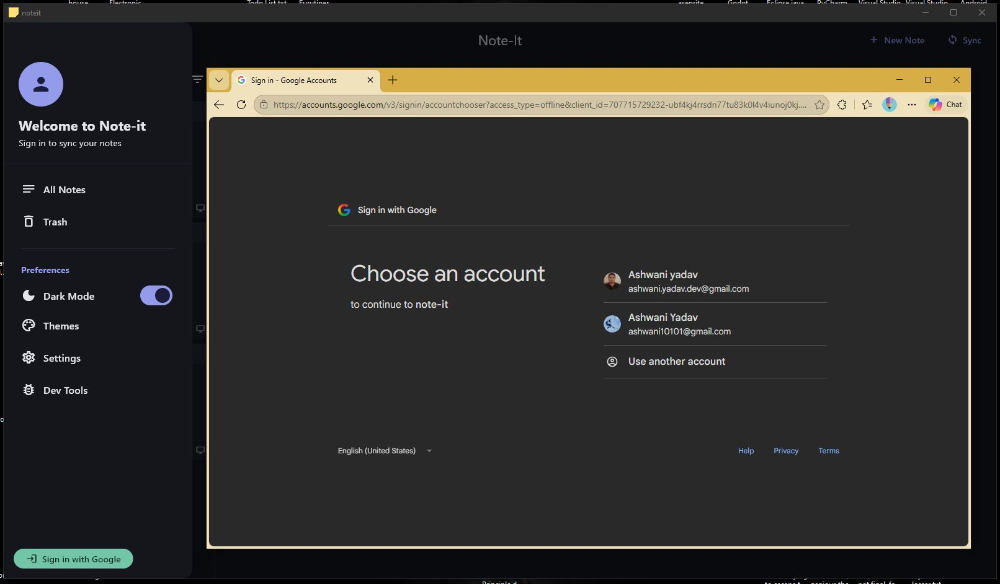 |

| Open Note | New Note |
| :---: | :---: |
| 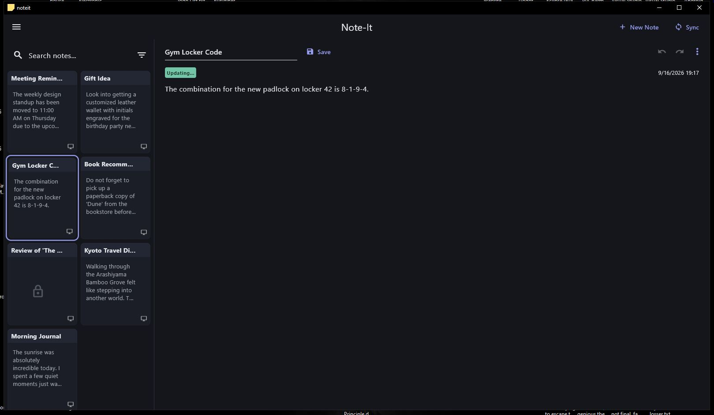 | 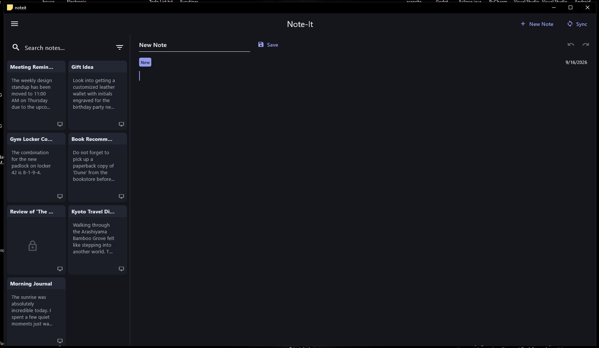 |

| Themes | Trash Bin |
| :---: | :---: |
| 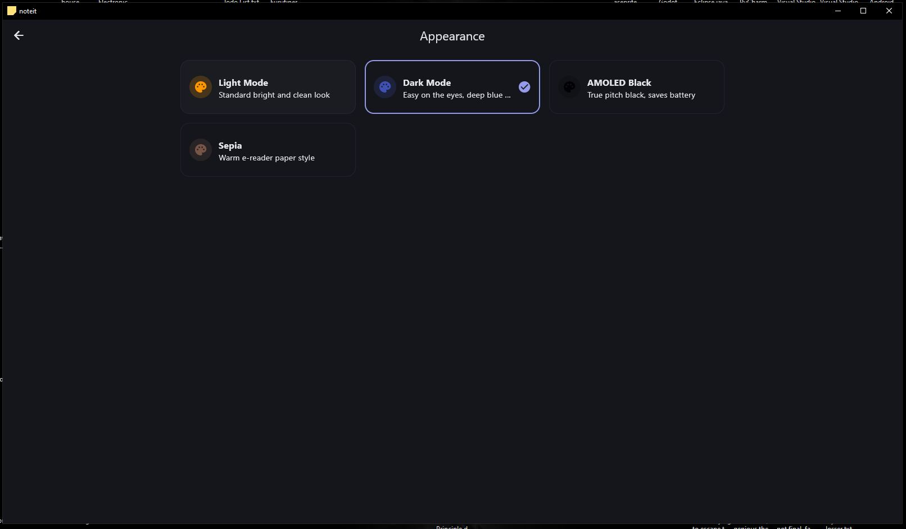 | 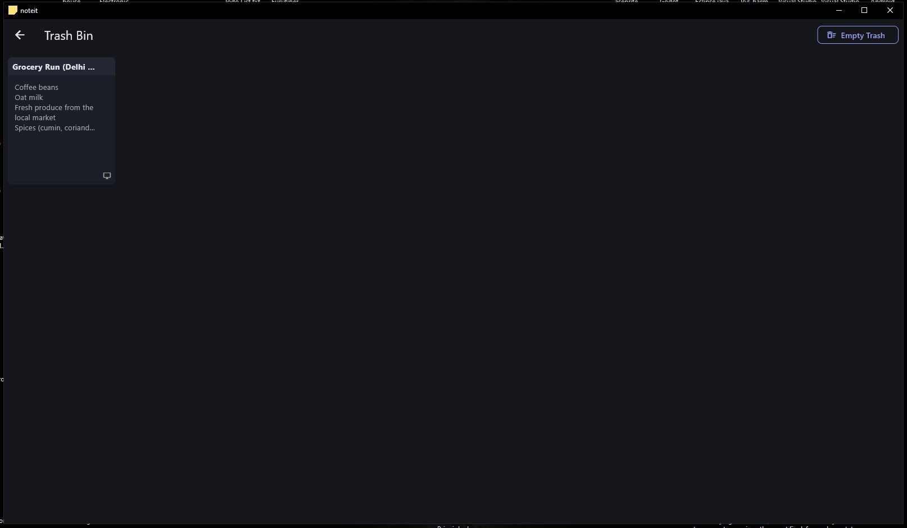 |

# Note-It 

A fast, offline-first cross-platform note-taking application for Android and Windows.

The core focus of this project is data ownership and sync reliability. Note-It handles state across three environments: a local SQLite database, a Firebase cloud backend, and a peer-to-peer local WiFi network using WebSockets.

## Features

**Dual-Sync Architecture**
- **Cloud Sync:** Standard real-time sync using Firebase.
- **Local WiFi Sync:** Peer-to-peer syncing without an internet connection. Uses mDNS for device discovery and WebSockets for data transfer. Includes dedicated Host/Client roles for stable pairing.
- **Manual Controls:** Pull-to-sync gesture (Android), dedicated sync buttons, and a control panel to toggle between Cloud, WiFi, and Offline modes.

**Note Management**
- **Smart Search:** Queries titles and content with real-time text highlighting for matched queries.
- **Advanced Sorting & Filtering:** Sort by creation date, last updated, or name. Filter notes by device origin (e.g., created on Windows vs. Android).
- **Editor:** Clean interface with undo/redo functionality and automated datetime stamping.
- **Data Recovery:** Dedicated recycle bin to restore deleted notes.

**Security & Customization**
- **App-Level Locking:** Password protect specific notes via the control panel.
- **Data Export:** Import/Export functionality to ensure data portability.
- **Theming:** Quick dark mode toggle and 4 distinct theme palettes (including a custom amber theme).
- **Authentication:** Google Sign-in integration for quick onboarding.

## Technical Implementation

### Tech Stack
- **Framework:** [Flutter](https://flutter.dev/) (SDK ^3.10.7)
- **State Management:** `flutter_riverpod` & `riverpod_annotation`
- **Local Database:** `drift` & `drift_flutter` (SQLite)
- **Backend/Auth:** `firebase_core`, `cloud_firestore`, `firebase_auth`, `google_sign_in_all_platforms`
- **P2P Networking:** `web_socket_channel`, `nsd` (Network Service Discovery)
- **Routing:** `go_router`

### Architectural Decisions

* **Handling Three-Way State:** Coordinating data between a local SQLite database, Firebase streams, and WebSocket channels required strict state management. I used Riverpod to isolate these data sources, ensuring the UI always reflects a single source of truth regardless of the active sync method.
* **Zero-Cloud Local Sync:** To make the app truly offline-first, I implemented mDNS (Multicast DNS) using the `nsd` package. This allows Windows and Android devices on the same local subnet to automatically discover each other without manual IP entry, establishing a WebSocket connection for zero-latency local data transfer.
* **Complex Querying:** Instead of using a simple key-value store, I chose Drift (SQLite) for local persistence. The relational database structure allows for efficient execution of complex queries, such as the multi-parameter sorting (Name/Date) and device-origin filtering features.

## Dependencies

**Core & State Management**
- [Flutter](https://flutter.dev/) (SDK ^3.10.7)
- `flutter_riverpod` & `riverpod_annotation` - For predictable, compile-safe state management.

**Storage & Database**
- `drift` & `drift_flutter` - Reactive, type-safe persistence for local SQLite databases.
- `shared_preferences` - For lightweight local data and theme settings caching.
- `path_provider` - For locating local file system paths.

**Backend & Authentication**
- `firebase_core`, `cloud_firestore`, `firebase_auth` - Cloud data synchronization and backend infrastructure.
- `google_sign_in_all_platforms` - Seamless OAuth integration.

**Navigation**
- `go_router` - Declarative routing and deep linking.

**Hardware & Connectivity**
- `mobile_scanner` & `qr_flutter` - For scanning and generating QR codes.
- `web_socket_channel` & `nsd` - For real-time network service discovery and WebSocket communications.
- `device_info_plus` - For fetching specific device metadata.

**Dev Dependencies**
- `build_runner` & `drift_dev` - Code generation.
- `flutter_launcher_icons` - Automated app icon generation.
