# 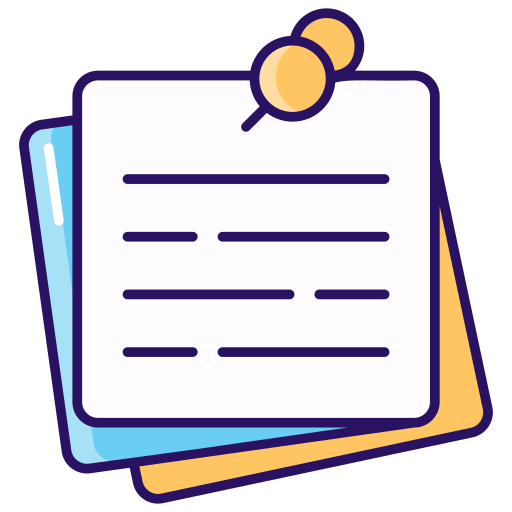 Note-It

A cross-platform note-taking app for mobile and desktop, built from the ground up to prioritize data ownership and peace of mind.

I built Note-It because I was tired of bloated, insecure alternatives. It lets you work seamlessly across devices with flexible sync options ranging from local storage and zero-cloud Wi-Fi syncing to full cloud backups. Paired with military-grade encryption for sensitive data, Note-It ensures your notes stay completely under your control.
<!-- Tech Stack & Networking -->

| Desktop | Mobile |
| :---: | :---: |
| 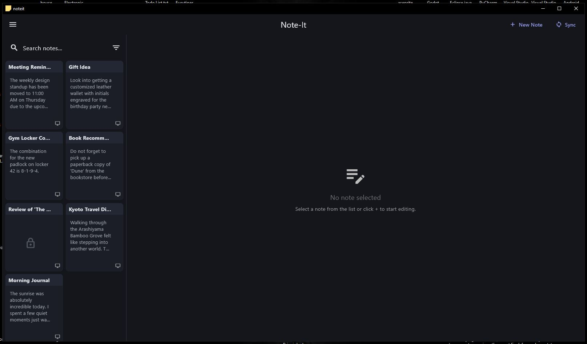 | 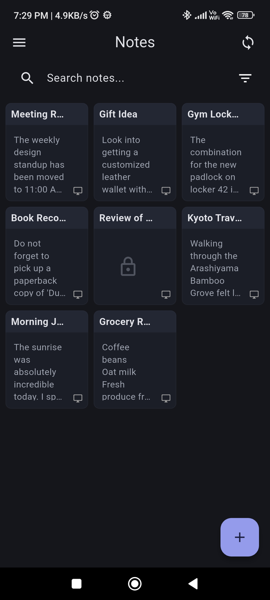 |

I chose a simple design approach that encapsulates the app's complex capabilities, allowing users to ease into the experience without feeling overwhelmed.

---

|                                Desktop                                 |                                   Mobile                                    |
|:----------------------------------------------------------------------:|:---------------------------------------------------------------------------:|
| 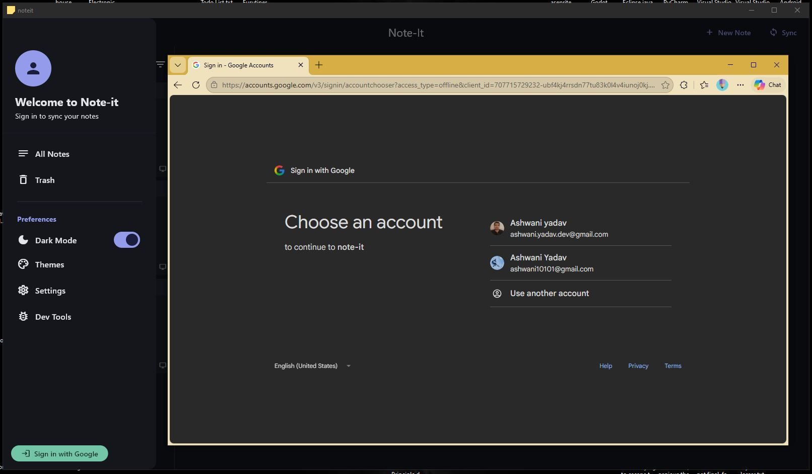 | 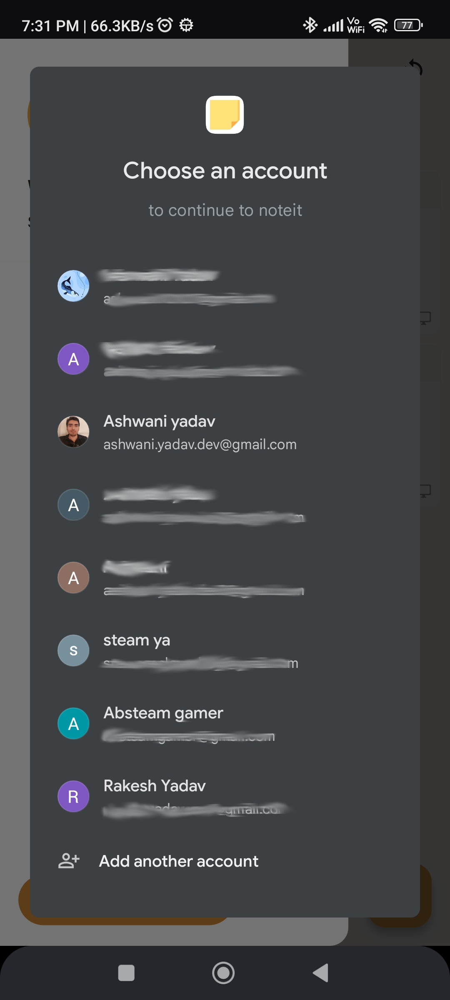 |

Supports Google authentication for Firebase synchronization. The benefit of syncing notes to the cloud is that you can access them from any device, anywhere in the world.

---

|                                   Desktop                                    |                                 Mobile                                 |
|:----------------------------------------------------------------------------:|:----------------------------------------------------------------------:|
| 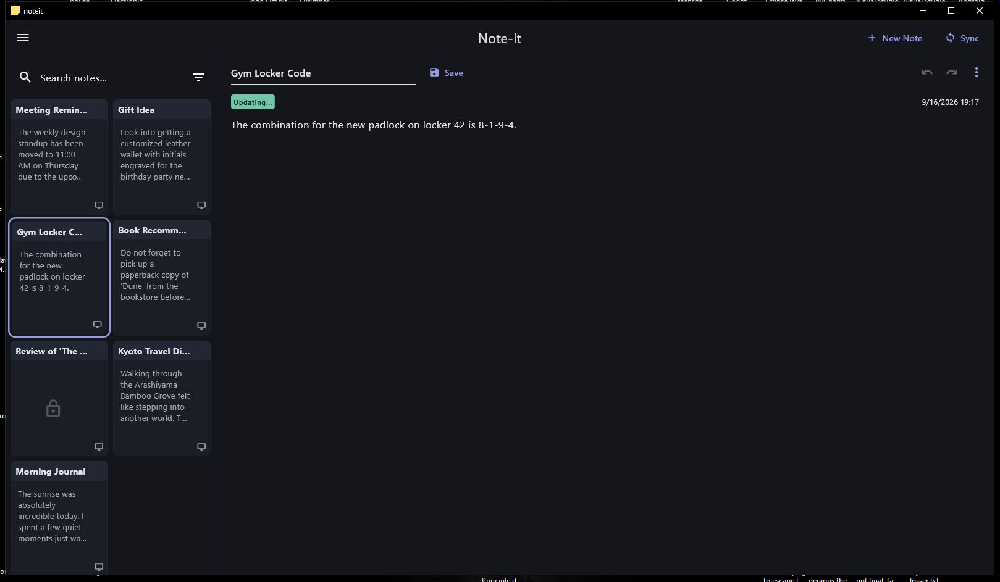 | 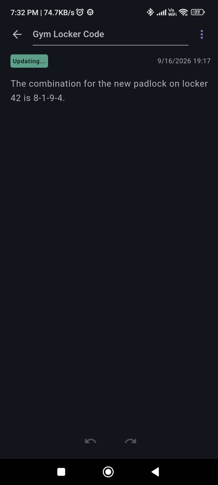 |

A simple note editor. The design is not finalized yet.

---

|                                Desktop                                |                                   Mobile                                   |
|:---------------------------------------------------------------------:|:--------------------------------------------------------------------------:|
| 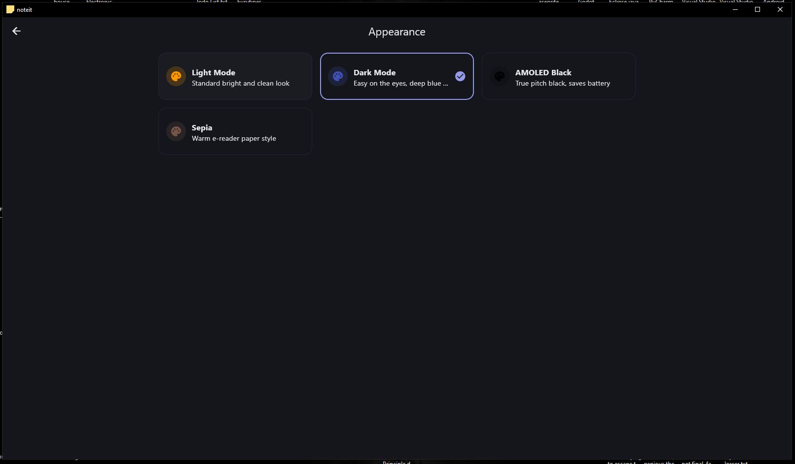 | 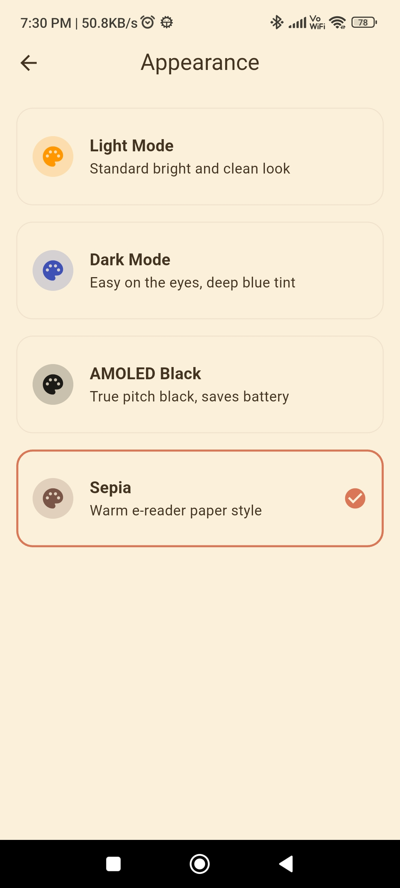 |

The themes page allows users to choose from a variety of themes. We currently support 4 themes, with plans to add 6 more before publishing the app to the Play Store.

---

|                                 Desktop                                 |                                 Mobile                                  |
|:-----------------------------------------------------------------------:|:-----------------------------------------------------------------------:|
| 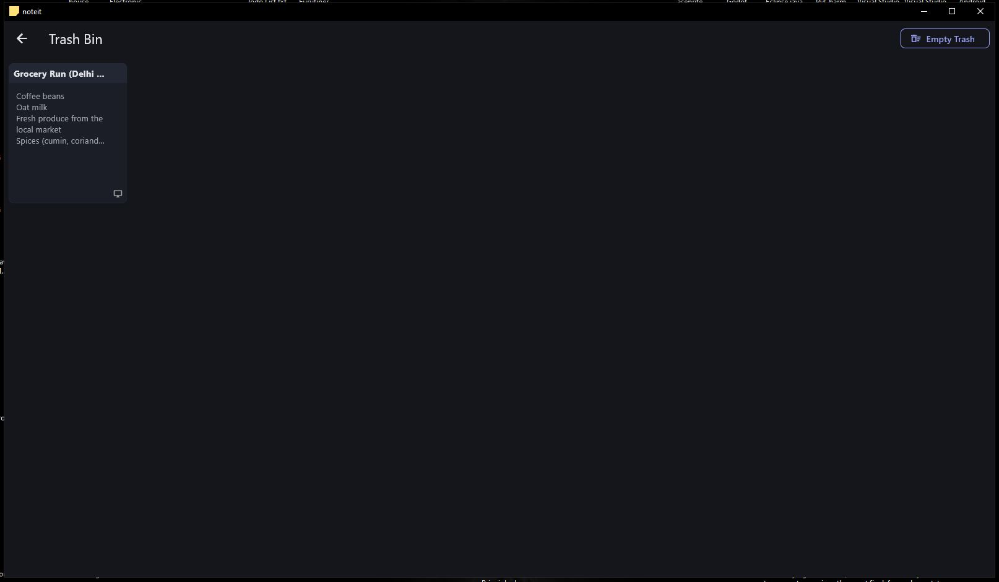 | 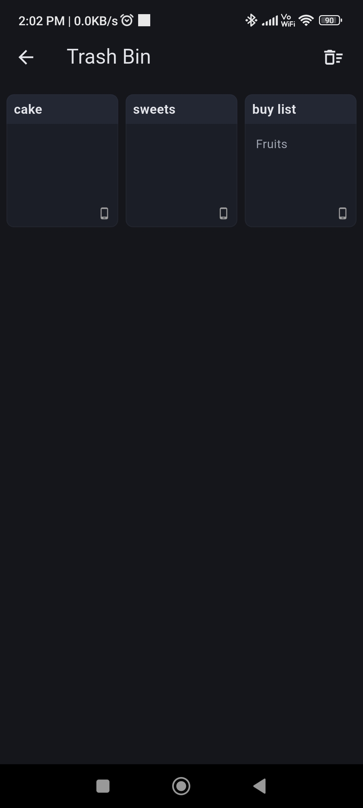 |

Added a trash bin to recover accidentally deleted notes, which can be configured to auto-clean after a month or a year.

---

|                                Desktop                                 |                                  Mobile                                  |
|:----------------------------------------------------------------------:|:------------------------------------------------------------------------:|
| 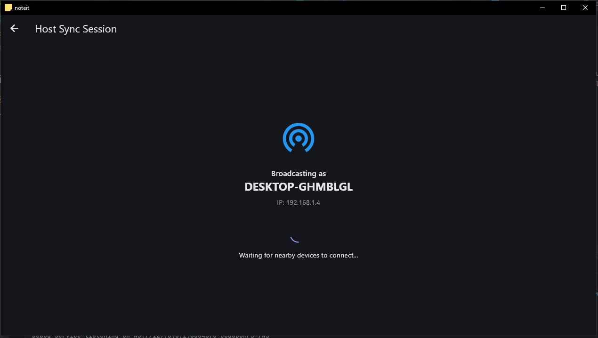 | 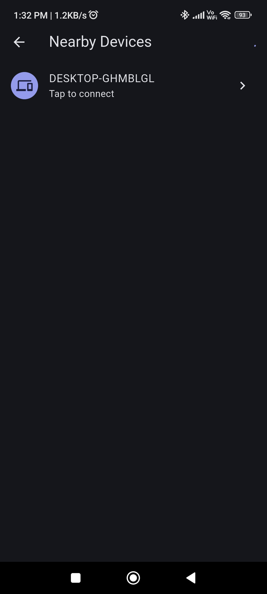 |

Hosting and connecting: uses mDNS for broadcasting device names over a custom TCP tag. Other devices can discover it, enter the correct PIN, and connect. *(Note: This screenshot is old; there is supposed to be a PIN display in the middle).*

### Some Other Screenshots

|                         Custom Highlighting                          |                                Filters                                |                                Password Lock                                 |
|:--------------------------------------------------------------------:|:---------------------------------------------------------------------:|:----------------------------------------------------------------------------:|
| 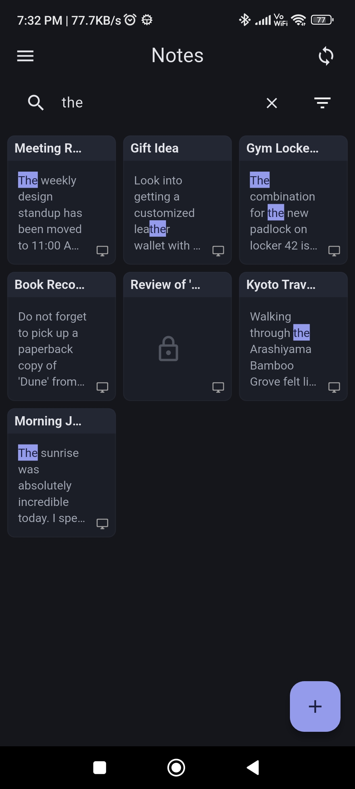 | 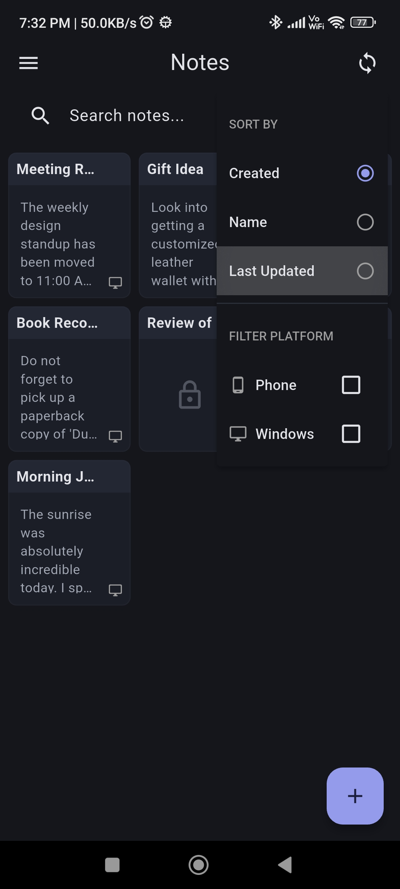 | 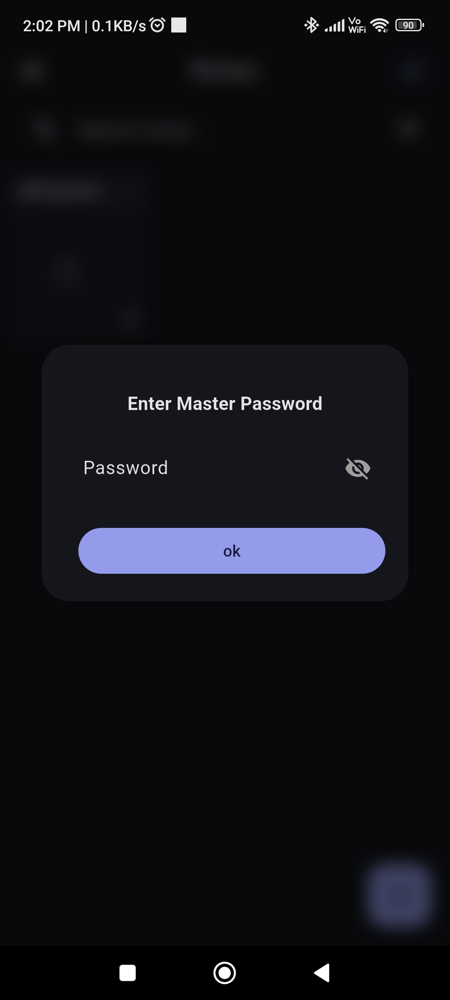 |

## ✨ Features

**Dual-Sync Architecture**
- ✅ **Cloud Sync:** Standard real-time sync using Firebase.
- ✅ **Local Wi-Fi Sync:** Peer-to-peer syncing without an internet connection. Uses mDNS for device discovery and WebSockets for data transfer. Includes dedicated Host/Client roles for stable pairing.
- ✅ **Manual Controls:** Pull-to-sync gesture (Android), dedicated sync buttons, and a control panel to toggle between Cloud, Wi-Fi, and Offline modes.

**Note Management**
- ✅ **Smart Search:** Queries titles and content with real-time text highlighting for matched queries.
- ✅ **Advanced Sorting & Filtering:** Sort by creation date, last updated, or name. Filter notes by device origin (e.g., created on Windows vs. Android).
- ✅ **Editor:** Clean interface with undo/redo functionality and automated datetime stamping.
- ✅ **Data Recovery:** Dedicated recycle bin to restore deleted notes.

**Security & Customization**
- ✅ **App-Level Locking:** Password protect specific notes via the control panel.
- ✅ **Data Export:** Import/Export functionality to ensure data portability.
- ✅ **Theming:** Quick dark mode toggle and 4 distinct theme palettes (including a custom amber theme).
- 🔒 **Authentication:** Google Sign-in integration for quick onboarding.

## 🏗️ Technical Implementation

### 💻 Tech Stack
- **Framework:** [Flutter](https://flutter.dev/) (SDK ^3.10.7)
- **State Management:** `flutter_riverpod` & `riverpod_annotation`
- **Local Database:** `drift` & `drift_flutter` (SQLite)
- **Backend/Auth:** `firebase_core`, `cloud_firestore`, `firebase_auth`, `google_sign_in_all_platforms`
- **P2P Networking:** `web_socket_channel`, `nsd` (Network Service Discovery)
- **Routing:** `go_router`

### 🧠 Architectural Decisions

* **Handling Three-Way State:** Coordinating data between a local SQLite database, Firebase streams, and WebSocket channels required strict state management. I used Riverpod to isolate these data sources, ensuring the UI always reflects a single source of truth regardless of the active sync method.
* **Zero-Cloud Local Sync:** To make the app truly offline-first, I implemented mDNS (Multicast DNS) using the `nsd` package. This allows Windows and Android devices on the same local subnet to automatically discover each other without manual IP entry, establishing a WebSocket connection for zero-latency local data transfer.
* **Complex Querying:** Instead of using a simple key-value store, I chose Drift (SQLite) for local persistence. The relational database structure allows for efficient execution of complex queries, such as the multi-parameter sorting (Name/Date) and device-origin filtering features.

## 📦 Dependencies

**Core & State Management**
- [Flutter](https://flutter.dev/) (SDK ^3.10.7)
- `flutter_riverpod` & `riverpod_annotation` - For predictable, compile-safe state management.

**Storage & Database**
- `drift` & `drift_flutter` - Reactive, type-safe persistence for local SQLite databases.
- `shared_preferences` - For lightweight local data and theme settings caching.
- `path_provider` - For locating local file system paths.

**Backend & Authentication**
- `firebase_core`, `cloud_firestore`, `firebase_auth` - Cloud data synchronization and backend infrastructure.
- `google_sign_in_all_platforms` - Seamless OAuth integration.

**Navigation**
- `go_router` - Declarative routing and deep linking.

**Hardware & Connectivity**
- `mobile_scanner` & `qr_flutter` - For scanning and generating QR codes.
- `web_socket_channel` & `nsd` - For real-time network service discovery and WebSocket communications.
- `device_info_plus` - For fetching specific device metadata.

**Dev Dependencies**
- `build_runner` & `drift_dev` - Code generation.
- `flutter_launcher_icons` - Automated app icon generation.

# License

This software is free for personal use and modification, but commercial use and selling for profit are strictly prohibited. Thank you